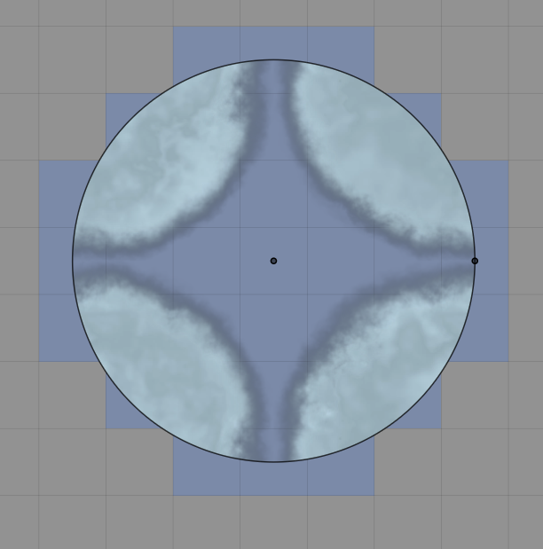
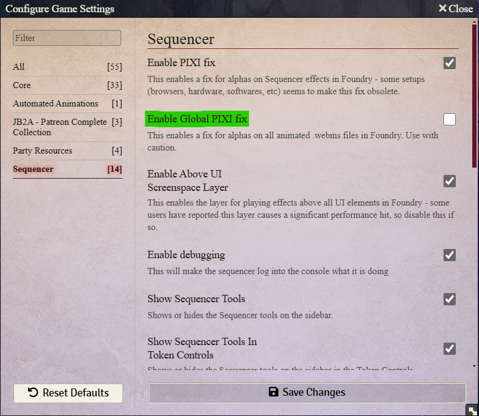
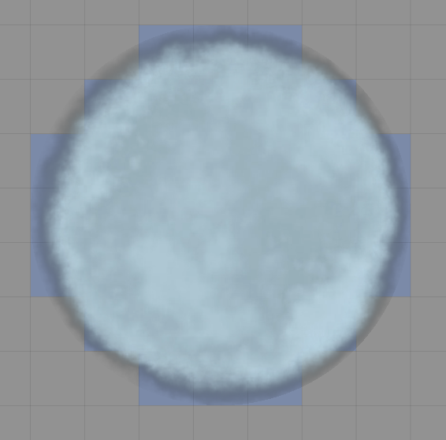
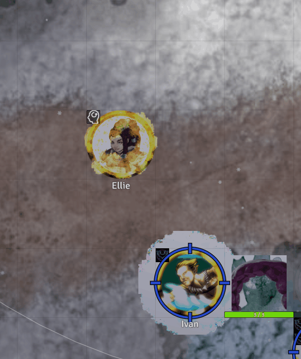
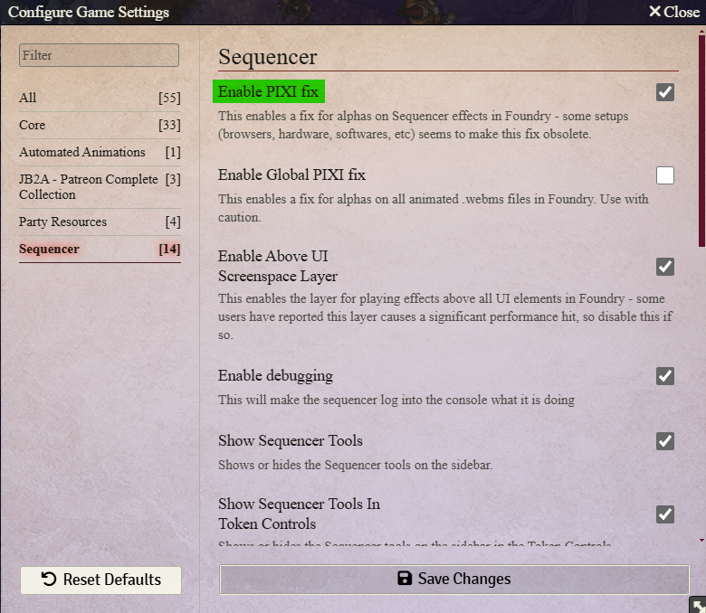

Ooooh ... I'm Stuck !

[Link to FAQ/JB2A/About](/docs/faq/jb2a.html#about-jb2a)
{: .fs-2 }

  <section>
    <h3>Two Individual Images</h3>
    

      
      
    

    
    

    <h3>A Four Image Set</h3>
    

      
      
      
      
    

  </section>

<!-- {:.glightbox}
{:.glightbox}

*

    
    

 -->

<video style="width: 256px; display: block; margin: 0 auto; " oncontextmenu="return false" id="AnimatedLogo" autoplay="true" muted="true" loop>
    <source src="/assets/images/logo-simple.webm" type="video/webm"></source>
</video>

# Patreon

### I can't find the manifest/download link

### I don't have access to the Master Post on Patreon even though I'm subscribed to a tier.
### Patreon doesn't let me upgrade/downgrade my subscription to another tier
### I can't access the Master Post on Patreon

# Forge
### I can't update the module on Forge
### Can't find the animations on Forge
### I tried to install your module with the manifest link

# Molten Hosting
### Issue installing on Molten Hosting

# AWS S3 Amazon Buckets
## The redirect to my AWS S3 Amazon bucket doesn't work

# Foundry VTT
### Error downloading JB2A
### Error installing JB2A manually using the "Complete Collection" Zip
### Error installing JB2A  manually using the "Only New Stuff" Zip
### Download takes too long, stops halfway through
### Error updating JB2A
### Can't find the animations at all
### Can't find the Patreon Assets, only the free
### I upgraded from the free module to the Patreon and now my tiles, tokens and macros aren't working
### I can't get the effects to trigger when I click on a spell
### Webm as Template texture looks tiled
### Webms look really pixalated, overblown like this
### Macro doesn't work / stopped working after update
### Persistent Animation keeps coming back
### Animations work for me, the GM but not for my players
> Check the Sequencer Permissions in the settings. 
> They need to be set to Players and above
### Some animations are missing from the dropdown menus of Automated-Animations
### Compendium thumbnails are broken

# Discord Server
### I should get a role on your server but it doesn't show up
### I should have access to Patreon-exclusive channels but I can't see them
### 

